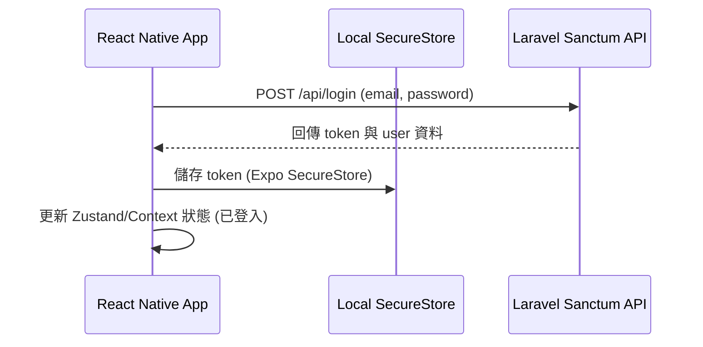

# React Native (Expo) App 設計規格說明書 (React Native App Spec)

本文件定義了 AI 詐騙辨識系統的行動 App 端 (React Native / Expo) 設計規格，以及後端 API 的擴充需求。

* **更新日期**：2026-05-28
* **狀態**：已批准 (Approved)

---

## 1. 系統架構與專案結構 (Architecture & Directory Structure)

為了維持環境隔離與專案整潔，App 專案將作為一個獨立的客戶端，平行建立於目前的 workspace 根目錄：

```text
scam_detecto/
├── scam-detector/        # 現有的 Laravel 12 + Vue 3 後端與 Web 專案
└── scam-detector-app/    # 新建的 Expo React Native 行動 App 專案
```

### Expo 專案核心技術選型
* **開發框架**：Expo SDK 51+ (React Native 0.74+)。
* **導頁與路由**：使用 `expo-router` 進行基於檔案系統的路由管理 (File-based Routing)。
* **API 通訊**：使用 `axios` 封裝 HTTP 請求，設定 `baseURL` 並以攔截器 (Interceptor) 自動在 Header 注入 `Authorization: Bearer <token>` 及 `X-Visitor-ID`。
* **本地安全儲存**：使用 `expo-secure-store` 進行加密儲存（僅限 Token），非敏感的 UI 設定可使用 `AsyncStorage`。
* **樣式系統**：使用 React Native 原生 `StyleSheet` 或 `NativeWind`，風格沿用 Web 版的 Cyberpunk 科幻風（深色底色、霓虹發光邊框、科幻掃描雷達特效）。

---

## 2. 資料流與 API 設計 (Data Flow & API Design)

App 與後端 Laravel 採用純 JSON API 進行非同步通訊。

### 2.1 身分驗證資料流


### 2.2 詐騙檢測資料流 (文字/網址/圖片)
1. **文字與網址檢測**：
   * 呼叫現有端點：`POST /api/scam/analyze-text` 與 `POST /api/scam/analyze-url`。
   * 參數：`text` 或 `url`。
2. **圖片檢測（後端新增 API 端點）**：
   * **端點**：`POST /api/scam/analyze-image`
   * **格式**：`multipart/form-data`
   * **參數**：`image` (檔案)
   * **後端邏輯**：接收圖檔後，呼叫 `OcrService` (Tesseract) 進行文字提取，並將提取出的文字送入 `AiFraudService`（或靜態 Fallback 降級處理），最後回傳與文字分析一致的 JSON 格式。
3. **訪客模式支援**：
   * 若使用者未登入，App 端會自動生成一個 UUID 作為 `visitor_id`。
   * 在發送檢測請求時，於 Header 夾帶 `X-Visitor-ID: <uuid>`。

### 2.3 歷史紀錄查詢
* **端點**：`GET /api/scam/history`
* **邏輯**：
  * 若有 Authorization Header，後端自動回傳該登入使用者的歷史紀錄。
  * 若無 Token，則由 App 端在網址參數加上 `?visitor_id=<uuid>` 查詢該訪客的歷史紀錄。

---

## 3. App 路由與前端組件設計 (App UI Components & Routing)

### 3.1 檔案路由結構 (`app/` 目錄)
* `app/_layout.tsx`：全域 Layout，包含狀態管理 Provider、主題樣式配置。
* `app/(auth)/`：身分驗證群組
  * `app/(auth)/login.tsx`：登入頁面。
  * `app/(auth)/register.tsx`：註冊頁面。
* `app/(tabs)/`：主畫面 Tab 導覽群組
  * `app/(tabs)/_layout.tsx`：定義底部 Navigation Tab（首頁、歷史、知識庫）。
  * `app/(tabs)/index.tsx` (Dashboard)：核心檢測畫面。提供文字/網址/圖片切換標籤與輸入框。
  * `app/(tabs)/history.tsx`：歷程紀錄清單。
  * `app/(tabs)/knowledge.tsx`：防詐騙案例知識庫。

### 3.2 核心 UI 組件
* `ScannerInput.tsx`：包含三種輸入模式的切換卡片。
* `ResultCard.tsx`：科幻面板，呈現風險分數與 AI 報告。
* `ScanningLoader.tsx`：具備科幻感的掃描動畫。

---

## 4. 錯誤處理與安全性 (Error Handling & Security)

* **連線超時與斷線**：捕獲 Axios 請求錯誤，在 App 畫面上渲染科幻風格的網路錯誤警告，且不阻礙 App 其他非網路功能的運作。
* **身分驗證失效**：當 API 請求回傳 `401 Unauthorized` 時，Axios 攔截器會觸發登出流程，清除 `SecureStore` 中的 Token，並強制跳轉至 `/login` 頁面。
* **原生權限要求**：在開啟圖片檢測時，主動偵測並詢問相機與相簿權限。若使用者拒絕，則優雅地隱藏上傳按鈕並提示權限要求。
* **資料安全**：敏感的 Token 資訊只儲存在加密的 `SecureStore` 中，防止遭到惡意讀取。
